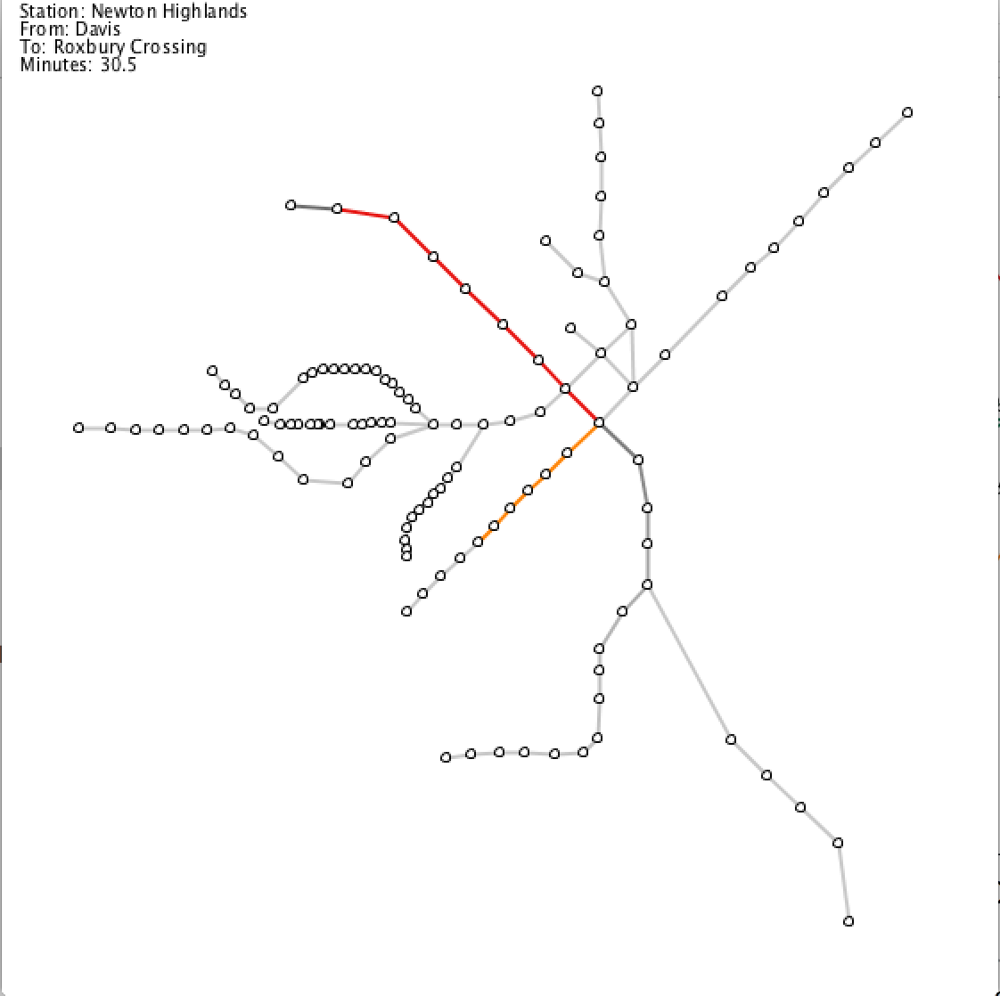

# HW4

This was some homework for the Data Visualization graduate course at Northeastern University. 

This is a visualization of the T, which is Boston's train network. Each station is a node and the tracks that run between two stations are an edge. [Processing](https://processing.org/) was used to render this network. Processing is a "flexible software sketchbook."

To clone this repository, run the following command in your terminal.
```git clone https://github.com/genagain/HW4.git```

In order to view the visualizations you must install processing, which can be installed [here](https://processing.org/download/)

These exercises culminate to one visualization as shown below.




When you hover over the stations with your cursor, the name of the station appears in th upper right hand corner.

When you click two points, the following are calculated:
 * The shortest path between the two stations
 * The time in minutes to travel between them

The every other edge except for the shortest path, turns grey.

Outine:
- Visualized Boston's T
- Used Processing
- Exercises culminate in finding the shortest path on the T intuitively
- Shortest Path Algo was from REFERENCE
- Instructions on how to run the last exercise
- Explaination/Instructions on how all the other exercises

If you do not have Ruby installed on your machine, please install it.

To run the Ruby Scripts in the "TheTDataCollection" directory, run the following commands in your terminal from the root of this project
```ruby TheTDataCollection/stations.rb```
```ruby TheTDataCollection/connections.rb```

